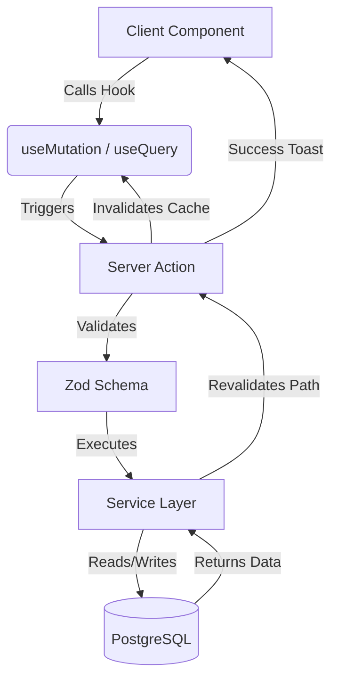

**Source Code Availability:**
This represents a commercial-grade application focusing on High Performance (100% Lighthouse) and Scalable Architecture.
Due to the proprietary nature of the implementation, the source code is available upon request for interviewers and potential employers. Please contact me at ninjastackx@gmail.com.

# 🚀 HQ-Commerce: High-Performance Enterprise Engine

**HQ-Commerce** is a cutting-edge, full-stack e-commerce ecosystem engineered with a focus on **Type-Safety**, **Financial Precision**, and **Scalable Hybrid Architecture**. Built for modern businesses, it bridges the gap between complex backend logic and fluid user experiences.

🔗 **Live Demo:** [hqstore.vercel.app](https://hqstore.vercel.app)  
🔗 **Dynamic Sitemap:** [hqstore.vercel.app/sitemap.xml](https://hqstore.vercel.app/sitemap.xml)

---

## 🏗️ Architectural Excellence

The project follows a **Multi-Layered Architecture** to ensure separation of concerns and maintainability:

- **Server-Side Hydration Layer:** Leveraging **TanStack Query v5** with `HydrationBoundary` for prefetching data on the server, achieving **Zero-CLS** and instant page loads.
- **Service-Repository Pattern:** Database logic is encapsulated within a dedicated `services/` layer, ensuring Prisma queries are reusable, testable, and decoupled from UI logic.
- **Advanced State Management:** A hybrid approach using **Zustand** for persistent client-side states (like Cart/UI) and **TanStack Query** for server-state synchronization and caching.
- **Atomic Transaction Management:** Checkout and inventory updates are executed as **Single Transactions** to prevent data race conditions and ensure 100% inventory accuracy.
- **Financial Data Integrity:** Implemented using **Decimal.js** and PostgreSQL `Decimal` types to eliminate floating-point errors in high-precision pricing and tax calculations.

---

## 🛠️ The Tech Stack (Modern Web Standards)

| Tech | Role |
| :--- | :--- |
| **Next.js 15** | App Router, Server Actions, and Partial Prerendering (PPR). |
| **TanStack Query v5** | Server State, Caching, Optimistic UI, and Hydration. |
| **Prisma & PostgreSQL** | Type-safe ORM with high-performance relational database. |
| **Zod** | End-to-end schema validation (Form, API, and Server Actions). |
| **Recharts** | Interactive business intelligence and sales analytics visualization. |
| **Auth.js v5** | Secure, session-based authentication with Cart Merging logic. |
| **Tailwind CSS** | Utility-first styling with custom Design System. |

---

## ✨ Enterprise Features

### 🛡️ Core Lifecycle Management
- **Intelligent Cart Merging:** Seamlessly merges Guest (Local) carts with User (Database) carts upon login without data loss.
- **Soft-Delete Architecture:** Critical entities (Products/Users) utilize a soft-delete system to maintain historical order integrity.
- **Price Snapshotting:** Freezes product pricing at the moment of order creation to protect financial records from future price updates.
- **Production-Ready Auth:** Robust Next-Auth v5 implementation optimized for Vercel, handling trusted hosts and secure session cookies.

### 📊 Business Intelligence & SEO
- **Visual Analytics Engine:** Integrated **Recharts** for real-time sales performance tracking, featuring interactive line charts and area graphs with automated data hydration.
- **Dynamic SEO Engine:** Automated XML Sitemap generation and `robots.txt` configuration for real-time search engine indexing and crawling.
- **Professional Admin Suite:** High-speed server-side filtering and optimistic CRUD operations for a "no-wait" administrative experience.

### 🎨 Premium Storefront UX
- **Dynamic Pricing Badges:** Real-time discount calculation with high-impact visual "floating stickers."
- **Technical Specs Engine:** Dynamic rendering of technical specifications from complex JSON structures.
- **RTL-First Design:** Native support for Arabic/Hebrew layouts with mirrored animations and Framer Motion micro-interactions.

---

## 📁 Project Structure

```bash
├── actions/        # Server Actions (Strongly typed entry points)
├── app/            # Next.js App Router (Routes, Layouts & Metadata)
├── services/       # Core Business Logic & Database Queries (Services)
├── hooks/          # Custom React Hooks (useCart, useUser, useOrders)
├── components/     # UI/UX Library (Atomic Design Architecture)
├── providers/      # Context & QueryClient Injection
├── lib/            # Utilities (Prisma Client, Formatting, Auth Config)
├── validation/     # Zod Schemas for Client/Server synchronization
└── types/          # Global TypeScript interfaces & Enums

```

---

## 🔄 Data Synchronization Flow



---

## 🚀 Getting Started

1. **Clone & Install:**

```bash
git clone [https://github.com/NinjaStackX/HQ-store.git](https://github.com/NinjaStackX/HQ-store.git)
cd HQ-store
pnpm install

```

2. **Environment Setup:** Create a `.env` file:

```env
DATABASE_URL="your_postgresql_url"
AUTH_SECRET="your_nextauth_secret"
AUTH_TRUST_HOST=true

```

3. **Database Migration:**

```bash
npx prisma migrate dev

```

4. **Development Mode:**

```bash
pnpm dev

```

---

**Developed with Precision by [NinjaStackX (Bashar)]** *Full-Stack Engineer specializing in high-scale systems and data-intensive applications.*

